# docker-labs

## Learning Docker properly — from first container to production-shaped images

Hands-on Docker labs, experiments, failures, debugging notes, and production-oriented practices.

This repository documents the learning path from Docker fundamentals to multi-service applications and production-shaped containers. The goal is not just to run commands, but to understand **why Docker behaves the way it does**.

> **Author:** Nero  
> **License:** MIT

---

## CI Status


---

## Environment

| Component | Environment |
|---|---|
| OS | Fedora Linux 44 |
| Runtime | Docker Engine 29.7.2 |
| Compose | Docker Compose v5.5.0 |
| Host integration | WSL2 |
| Docker daemon | Linux Docker Engine |
| Container runtime | Docker Engine |

> This repository uses Docker Engine inside Fedora WSL2 rather than Docker Desktop.

---

# 1. What this repository is about

This is a working laboratory repository rather than a copy of a tutorial.

Every major topic was learned through hands-on experiments, including cases where the first attempt failed.

The repository keeps the reasoning and troubleshooting alongside the implementation:

- `JOURNAL.md` — detailed failures, observations, and debugging
- `daily-summary/` — daily learning summaries
- `cheatsheets/` — command/reference material
- `examples/` — focused Docker examples
- `projects/` — larger multi-service exercises
- `.github/workflows/` — automated validation and image builds

The objective is to be able to explain Docker concepts from first principles instead of memorizing commands.

---

# 2. Learning Journey

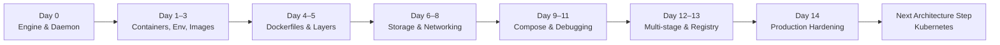

---

# 3. Progress

| Day | Topic | Main Concepts |
|---|---|---|
| Day 0 | Docker Engine | Installation, daemon, socket permissions |
| Day 1 | Containers | Lifecycle, ports, exit codes, signals |
| Day 2 | Environment | Environment variables, `--rm`, restart policies |
| Day 3 | Images | Tags, digests, registries |
| Day 4 | Dockerfile | First custom image |
| Day 5 | Build optimization | Layers, cache, `.dockerignore` |
| Day 6 | Named volumes | Persistent application data |
| Day 7 | Bind mounts | Host filesystem, live reload, UID mismatch |
| Day 8 | Networks | Container networking and DNS |
| Day 9 | Docker Compose | Multi-container application definition |
| Day 10 | Multi-service stack | Dependencies and healthchecks |
| Day 11 | Debugging | Logs, inspect, exit codes |
| Day 12 | Multi-stage builds | Smaller production images |
| Day 13 | Registry | Publishing images, tags and digests |
| Day 14 | Hardening | Non-root users, limits, scanning, pinned bases |

---

# 4. Docker Mental Model

The most important model from the labs:

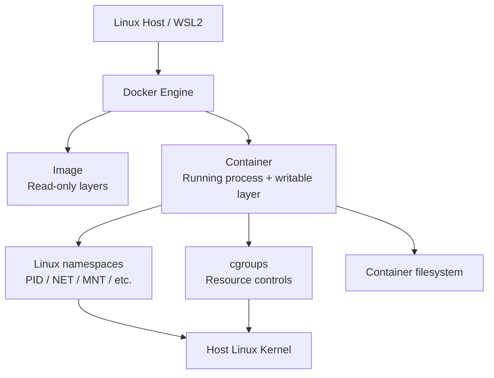

A container is **not a virtual machine**.

The image supplies the application and userland filesystem. The container is a running process isolated using Linux kernel mechanisms. The host kernel is still shared.

---

# 5. Containers vs Virtual Machines

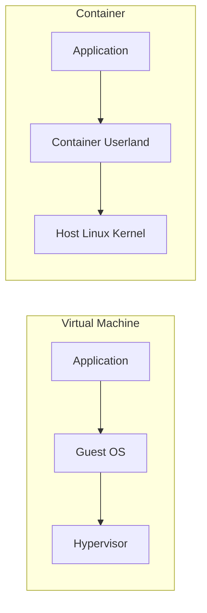

### Key distinction

A VM normally includes a complete guest operating system.

A container normally packages:

- application
- dependencies
- userland filesystem

while sharing the host kernel.

This difference explains much of Docker's startup speed and resource model.

---

# 6. Container Filesystem and Persistence

A running container gets a writable layer above the image's read-only layers.

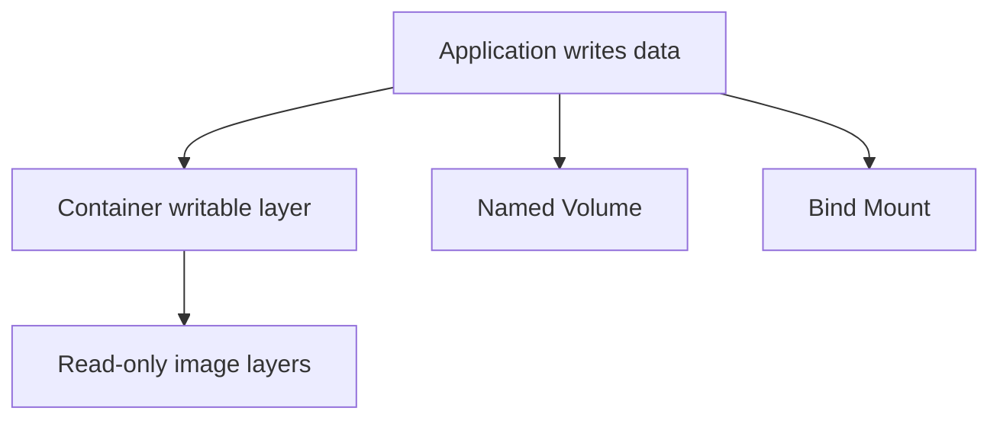

### Lifecycle behavior

| Storage | Survives container stop/start | Survives `docker rm` | Managed by |
|---|---:|---:|---|
| Writable container layer | Yes | No | Docker |
| Named volume | Yes | Yes | Docker |
| Bind mount | Yes | Yes | Host filesystem |

The writable layer is useful for temporary runtime changes.

Persistent application data should normally use a volume or an explicitly managed bind mount.

---

# 7. Named Volumes

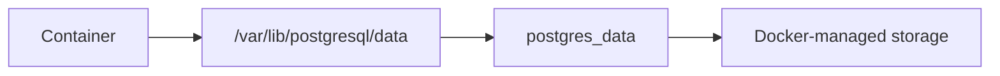

Example:

```yaml
services:
  db:
    image: postgres:17-alpine
    environment:
      POSTGRES_PASSWORD: postgres
    volumes:
      - postgres_data:/var/lib/postgresql/data

volumes:
  postgres_data:
```

Important behavior:

```bash
docker compose down
```

removes containers and the Compose network, but preserves declared named volumes.

```bash
docker compose down -v
```

also removes the declared volumes and their data.

---

# 8. Bind Mounts

A bind mount connects a container path directly to a host path.

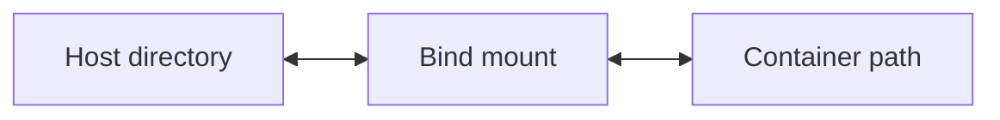

Example:

```bash
docker run --rm \
  -v "$PWD":/app \
  image-name
```

Important observations:

- Docker does not translate Linux file ownership for you.
- UID/GID mismatches can produce permission problems.
- A bind mount exposes the selected host filesystem path to the container.
- A bind mount by itself does **not** implement live reload.

Live reload requires the application itself to detect file changes and reload/restart.

---

# 9. Container Lifecycle

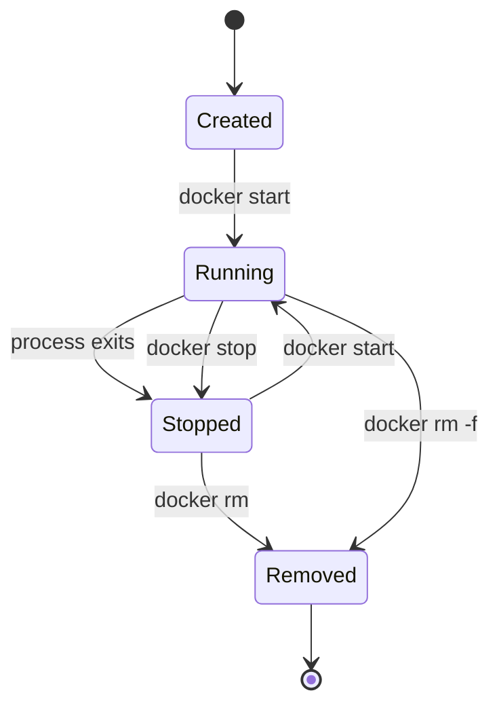

Useful commands:

```bash
docker run IMAGE
docker ps
docker ps -a
docker start CONTAINER
docker stop CONTAINER
docker restart CONTAINER
docker rm CONTAINER
docker logs CONTAINER
docker exec -it CONTAINER sh
docker inspect CONTAINER
```

---

# 10. Exit Codes

Container exit codes provide useful debugging information.

| Exit code | Typical meaning |
|---:|---|
| `0` | Successful completion |
| `1` | Application/general error |
| `126` | Command found but cannot be executed |
| `127` | Command not found |
| `137` | Usually SIGKILL; commonly associated with OOM/resource termination |
| `143` | SIGTERM |

Do not assume every `137` means OOM.

Check the container state:

```bash
docker inspect CONTAINER \
  --format '{{.State.OOMKilled}}'
```

If the result is:

```text
true
```

Docker reports that the container was OOM-killed.

---

# 11. Signals and PID 1

A container's main process becomes PID 1 inside its PID namespace.

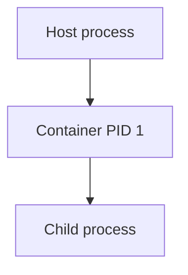

PID 1 has special signal-handling behavior.

This is one reason process managers, shell wrappers, and application entrypoints need to be designed carefully.

For workloads that benefit from a minimal init process:

```bash
docker run --init IMAGE
```

This can use an init process such as `tini` to help with signal forwarding and child-process reaping.

---

# 12. `ENTRYPOINT` and `CMD`

Docker combines image metadata from `ENTRYPOINT` and `CMD`.

Conceptually:

```dockerfile
ENTRYPOINT ["application"]
CMD ["--default-argument"]
```

becomes:

```text
application --default-argument
```

A base image's `ENTRYPOINT` can therefore affect how a child image's `CMD` behaves.

When debugging an unexpected startup command:

```bash
docker inspect IMAGE
```

Look at:

```text
Config.Entrypoint
Config.Cmd
```

---

# 13. Ports

`EXPOSE` and `-p` are different concepts.

### Dockerfile

```dockerfile
EXPOSE 8080
```

This documents the intended container port in image metadata.

It does **not** publish the port to the host.

### Runtime

```bash
docker run -p 8080:8080 IMAGE
```

This publishes:

```text
HOST_PORT:CONTAINER_PORT
```

Example:

```text
localhost:8080 → container:8080
```

Host ports must be unique among processes/listeners that use the same host network namespace.

---

# 14. Environment Variables

Example:

```bash
docker run \
  -e APP_COLOR=blue \
  IMAGE
```

Environment variables are convenient configuration inputs, but they are not a secret-management system.

They can be visible through Docker metadata and from inside the container.

For example:

```bash
docker inspect CONTAINER
```

and:

```bash
docker exec CONTAINER env
```

Therefore, secrets should be handled with an appropriate secret-management mechanism rather than assuming that an environment variable is hidden.

---

# 15. `.env` / Environment Files

An environment file can make configuration easier:

```bash
docker run --env-file .env IMAGE
```

It also avoids repeatedly typing secrets into the interactive shell.

However:

> An env file is not equivalent to secure secret storage.

Once values are supplied to a container, they may still be discoverable through container configuration or from inside the process environment.

---

# 16. Docker Images

An image is composed of layers.

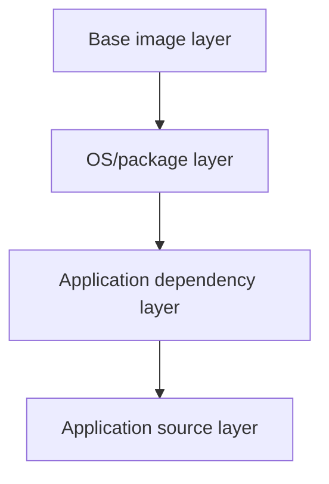

Containers use the image layers as their starting filesystem and add a writable container layer.

---

# 17. Tags vs Digests

A tag is a human-friendly reference:

```text
python:3.12-slim
```

A digest identifies a specific immutable image content:

```text
python:3.12-slim@sha256:...
```

Conceptually:

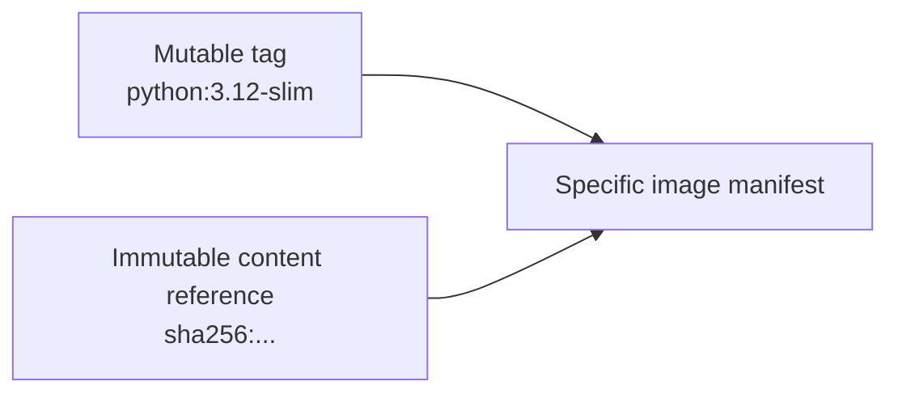

A tag can move to different image content.

A digest is content-addressed and identifies a specific image.

---

# 18. Image Size and Shared Layers

`docker image ls` is not a complete picture of how much unique disk space an image consumes.

Inspect detailed storage information with:

```bash
docker system df -v
```

This helps identify:

- shared layers
- unique layers
- reclaimable space

Two images can appear large while sharing many of the same underlying layers.

---

# 19. Image Architecture

Modern registries can publish multi-platform images.

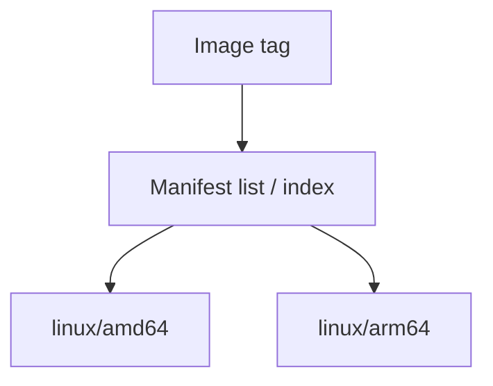

The client can select the appropriate platform image.

This matters when developing across:

- x86_64 systems
- ARM64 laptops
- ARM-based cloud instances
- CI runners

---

# 20. Dockerfile Layer Ordering

A common optimization pattern is to copy dependency metadata before application source.

Example:

```dockerfile
FROM python:3.12-slim

WORKDIR /app

COPY requirements.txt .

RUN pip install --no-cache-dir -r requirements.txt

COPY . .

CMD ["python", "app.py"]
```

Why?

If application source changes but `requirements.txt` does not, Docker can reuse the dependency installation layer.

A less efficient pattern is:

```dockerfile
COPY . .
RUN pip install -r requirements.txt
```

because ordinary source changes can invalidate the dependency-installation layer.

---

# 21. Build Cache

Docker build cache is daemon-side.

Useful commands:

```bash
docker build .
docker build --no-cache .
docker build --pull .
```

### `--no-cache`

Disables reuse of existing build cache.

### `--pull`

Attempts to pull a newer version of the referenced base image.

They solve different problems.

A rebuild with:

```bash
docker build --no-cache .
```

does not automatically mean that the base image is refreshed.

---

# 22. `.dockerignore`

A `.dockerignore` file controls which files are sent into the Docker build context.

Example:

```text
.git
.gitignore
node_modules
__pycache__
*.log
.env
README.md
```

This is particularly important when Dockerfiles use broad instructions such as:

```dockerfile
COPY . .
```

Reducing the build context can improve build performance and reduce accidental inclusion of unnecessary files.

---

# 23. Networking

Docker networking gives containers isolated network namespaces.

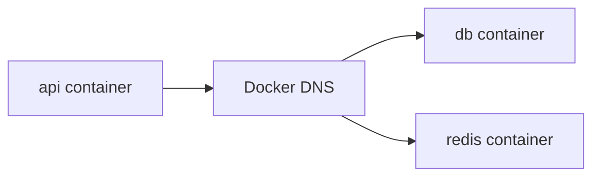

On a user-defined Docker network, containers can communicate using service/container names rather than hard-coded IP addresses.

Example:

```bash
docker network create app-net
```

Then:

```bash
docker run -d --name db --network app-net postgres:17-alpine
docker run -it --rm --network app-net alpine
```

From the second container:

```bash
ping db
```

or connect using the hostname:

```text
db
```

---

# 24. `localhost` Inside a Container

One of the most important networking lessons:

> `localhost` inside a container refers to that container itself.

It does not mean:

- the Docker host
- another container
- a Compose service

For example:

```text
api container
    |
    +-- localhost → api container
```

not:

```text
api container
    |
    +-- localhost → db container
```

For service-to-service communication, use the service/container DNS name.

---

# 25. Docker Network DNS

User-defined Docker networks provide container-name/service-name based discovery.

Example:

```text
api → db
```

The application can use:

```text
postgresql://db:5432/database
```

rather than depending on a container IP address.

Container IPs can change when containers are recreated.

Service names provide a stable logical endpoint.

---

# 26. Network Connectivity Is Dynamic

Docker networks can be manipulated while containers are running.

Useful commands:

```bash
docker network ls
docker network inspect NETWORK
docker network connect NETWORK CONTAINER
docker network disconnect NETWORK CONTAINER
```

This is useful when troubleshooting connectivity or testing network isolation.

---

# 27. Docker Compose

Compose turns a multi-container application into declarative configuration.

Example:

```yaml
services:
  db:
    image: postgres:17-alpine
    environment:
      POSTGRES_PASSWORD: postgres

  api:
    image: alpine
    command: ["sleep", "infinity"]
    depends_on:
      - db
```

Validate without starting containers:

```bash
docker compose config
```

This is one of the fastest ways to catch:

- YAML syntax problems
- indentation errors
- interpolation problems
- malformed Compose configuration

---

# 28. YAML: Spaces, Not Tabs

YAML indentation is structural.

Use spaces:

```yaml
services:
  db:
    image: postgres:17-alpine
```

Avoid tabs.

A tab inserted accidentally by an editor can cause Compose parsing failures.

---

# 29. Compose Networks and Volumes

Compose automatically creates a project network for services.

Declared named volumes are managed by Compose.

Example:

```yaml
services:
  db:
    image: postgres:17-alpine
    volumes:
      - postgres_data:/var/lib/postgresql/data

volumes:
  postgres_data:
```

Lifecycle:

```bash
docker compose up -d
```

Creates/starts the application.

```bash
docker compose down
```

Removes containers and networks while retaining named volumes.

```bash
docker compose down -v
```

Removes containers, networks, and declared volumes.

---

# 30. `depends_on` Is Not Readiness

This is an important distinction.

```yaml
depends_on:
  - db
```

expresses a startup dependency/order.

It does not necessarily mean:

```text
database is fully ready to accept application connections
```

A database may need additional time after its process starts.

For production-shaped Compose applications, healthchecks and application-level retry behavior should be considered.

---

# 31. Healthchecks

Example:

```dockerfile
HEALTHCHECK --interval=10s --timeout=3s --retries=3 \
  CMD python -c "import urllib.request; urllib.request.urlopen('http://127.0.0.1:5000/health')" || exit 1
```

The healthcheck runs **inside the container**.

Using:

```text
127.0.0.1
```

is intentional when checking a service listening inside the same container.

A healthcheck only proves what its command actually tests.

A successful TCP connection does not automatically prove that the application is functioning correctly.

---

# 32. Restart Policies

Restart policies can be used to control container recovery behavior.

Example:

```yaml
restart: unless-stopped
```

Useful concepts include:

```bash
docker inspect CONTAINER
```

and checking:

```text
RestartCount
```

Restart behavior should be distinguished from application health.

A process can restart repeatedly while still being unhealthy.

---

# 33. Debugging Workflow

When a container fails, avoid immediately rebuilding everything.

Use a structured workflow:

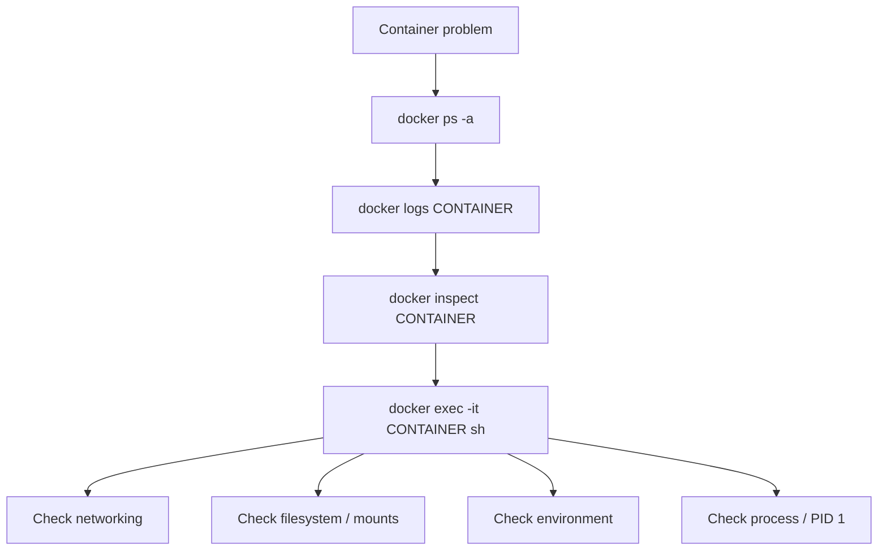

Core commands:

```bash
docker ps -a
docker logs CONTAINER
docker inspect CONTAINER
docker exec -it CONTAINER sh
docker stats
docker events
docker system df -v
```

---

# 34. Multi-stage Builds

Multi-stage builds separate build dependencies from the final runtime image.

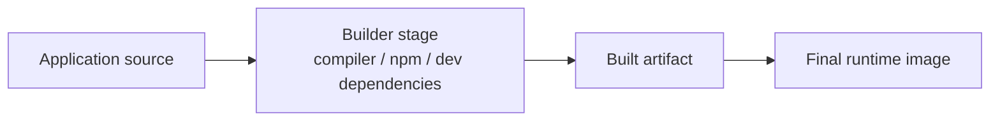

Example:

```dockerfile
FROM node:24 AS builder

WORKDIR /app

COPY package*.json ./
RUN npm ci

COPY . .
RUN npm run build

FROM nginx:alpine

COPY --from=builder /app/dist /usr/share/nginx/html
```

The final image does not need to contain the complete Node build environment.

Benefits:

- smaller runtime image
- fewer unnecessary packages
- reduced runtime attack surface
- clearer separation between build and runtime

---

# 35. Registry Workflow

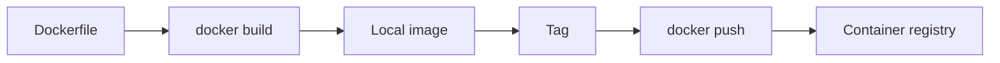

Typical commands:

```bash
docker build -t username/application:1.0.0 .
docker tag username/application:1.0.0 username/application:latest
docker push username/application:1.0.0
```

Inspect image references:

```bash
docker image inspect IMAGE
docker image ls
```

---

# 36. Registry Tags and Digests

A registry can contain:

```text
application:latest
application:1.0.0
application:1.1.0
```

Tags are convenient but mutable.

A digest identifies specific content.

For deployment-oriented workflows, immutable references can provide stronger reproducibility.

---

# 37. Registry Layer Deduplication

Registries store image layers.

If multiple tags or images reference the same layer, the registry can avoid storing duplicate layer content within its applicable repository/storage scope.

This is one reason layered images can be efficient even when multiple images appear large individually.

---

# 38. Production-shaped Python Container

Example pattern used in the labs:

```dockerfile
FROM python:3.12-slim

WORKDIR /app

COPY requirements.txt .

RUN pip install --no-cache-dir -r requirements.txt

COPY . .

RUN useradd -m appuser

USER appuser

ENV PYTHONUNBUFFERED=1

CMD ["gunicorn", "--bind", "0.0.0.0:5000", "--workers", "2", "app:app"]
```

Healthcheck:

```dockerfile
HEALTHCHECK --interval=10s --timeout=3s --retries=3 \
  CMD python -c "import urllib.request; urllib.request.urlopen('http://127.0.0.1:5000/health')" || exit 1
```

---

# 39. Non-root Containers

Running as root inside a container is not required for many applications.

Example:

```dockerfile
RUN useradd -m appuser
USER appuser
```

The principle is:

> Give the application only the privileges it needs.

Running as a non-root user can reduce the impact of some container compromises.

It does not replace:

- image scanning
- network controls
- secrets management
- host security
- runtime isolation
- least-privilege design

---

# 40. Digest-pinned Base Images

A production-oriented Dockerfile can pin a base image by digest:

```dockerfile
FROM python:3.12-slim@sha256:78387bc3881b8273120a12ebe6c1ab22b018ccc2c9adf565ae1ac9b536e184ea
```

This provides deterministic reference to a specific image content.

However:

> Digest pinning does not automatically patch the operating system or application dependencies.

A pinned image still needs an update process.

---

# 41. Security Scanning

Image scanning is useful for identifying known vulnerabilities.

A scan should be repeated as images and vulnerability databases change.

A clean scan today does not permanently mean that an image is vulnerability-free.

Security is therefore a lifecycle process:

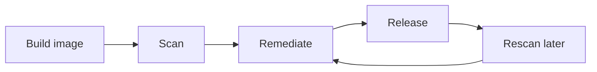

---

# 42. Resource Limits

Containers can be constrained with CPU and memory controls.

Example:

```bash
docker run \
  --memory=256m \
  --cpus=0.5 \
  IMAGE
```

Resource limits are useful because application failure and resource exhaustion are different failure modes.

When investigating memory termination, inspect:

```bash
docker inspect CONTAINER
```

and specifically check:

```text
State.OOMKilled
```

---

# 43. Docker Group Security

On Linux, access to the Docker daemon socket effectively provides highly privileged control over the host.

For example:

```text
/var/run/docker.sock
```

Membership in the `docker` group should therefore be treated as privileged access.

This is an important operational and security consideration.

---

# 44. What I Can Explain — Not Just Run

## Containers

- A container is not a VM.
- The image provides userland/application content.
- Containers use Linux kernel isolation mechanisms.
- The writable layer belongs to the container.
- Stopping a container does not remove its writable layer.
- Removing a container removes its writable layer.
- Volumes and bind mounts provide persistence outside that writable layer.

## Images

- Tags are references and can move.
- Digests identify specific content.
- Image layers can be shared.
- `docker system df -v` helps show shared and reclaimable storage.
- Multi-platform images can use a manifest/index to select platform-specific content.
- `EXPOSE` is metadata; `-p` publishes ports.

## Storage

- Named volumes are Docker-managed.
- Bind mounts directly expose selected host paths.
- Bind mounts do not automatically provide live reload.
- UID/GID mismatches can cause permission problems.
- Typing a different volume name can silently create a different volume.

## Networking

- `localhost` inside a container means that container.
- User-defined networks provide service/container DNS.
- Service names are preferable to hard-coded container IPs.
- Containers can be dynamically connected to or disconnected from networks.
- Compose creates a project network automatically.

## Compose

- `docker compose config` validates/renders configuration without starting services.
- YAML indentation must use spaces.
- Named volumes must be declared when using top-level volume definitions.
- `docker compose down` removes containers/network but preserves named volumes.
- `docker compose down -v` removes named volumes too.
- `depends_on` should not be confused with application readiness.
- Healthchecks test the command you define, not the whole application.

## Production

- Layer ordering affects build-cache efficiency.
- `.dockerignore` reduces unnecessary build context.
- Multi-stage builds reduce final image contents.
- Non-root execution reduces unnecessary privileges.
- Digest-pinned bases improve reproducibility.
- Pinned bases still require patch/update management.
- Image scanning needs to be repeated.
- Runtime resource limits help control resource consumption.

---

# 45. Repository Structure

```text
docker-labs/
│
├── cheatsheets/
│   └── ...
│
├── daily-summary/
│   ├── day0.md
│   ├── day1.md
│   └── ...
│
├── examples/
│   └── ...
│
├── projects/
│   ├── 01-node-postgres/
│   ├── 02-python-redis/
│   └── 03-react-multistage/
│
├── .github/
│   └── workflows/
│       └── docker-ci.yml
│
├── CLAUDE.md
├── JOURNAL.md
└── README.md
```

---

# 46. Projects

## 01 — Node + PostgreSQL

A multi-service application used to practice:

- Docker networking
- PostgreSQL
- service dependencies
- persistent database storage
- Compose

## 02 — Python + Redis

Used to practice:

- Python application containers
- Redis
- service-to-service networking
- healthchecks
- environment configuration
- production-shaped Python images

## 03 — React Multi-stage

Used to practice:

- frontend builds
- Node build environments
- multi-stage Dockerfiles
- production runtime images
- static asset serving

---

# 47. CI Pipeline

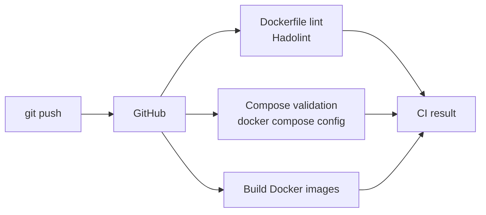

The CI workflow validates the repository automatically rather than relying only on local testing.

The workflow includes:

- Dockerfile linting
- Compose validation
- Docker image builds
- automatic discovery of Docker build inputs

---

# 48. Recommended Local Workflow

For a new change:

```bash
git status
```

Inspect the change:

```bash
git diff
```

Validate Compose files:

```bash
docker compose config
```

Build:

```bash
docker build .
```

Run:

```bash
docker compose up -d --build
```

Inspect:

```bash
docker compose ps
docker compose logs
```

Test:

```bash
docker ps
```

Clean up:

```bash
docker compose down
```

If disposable volume data should also be removed:

```bash
docker compose down -v
```

---

# 49. Useful Docker Commands

## Containers

```bash
docker ps
docker ps -a
docker run IMAGE
docker start CONTAINER
docker stop CONTAINER
docker restart CONTAINER
docker rm CONTAINER
docker rm -f CONTAINER
```

## Logs and debugging

```bash
docker logs CONTAINER
docker logs -f CONTAINER
docker inspect CONTAINER
docker exec -it CONTAINER sh
docker stats
```

## Images

```bash
docker image ls
docker image inspect IMAGE
docker pull IMAGE
docker build -t NAME:TAG .
docker tag SOURCE TARGET
docker push IMAGE
```

## Networks

```bash
docker network ls
docker network inspect NETWORK
docker network create NETWORK
docker network connect NETWORK CONTAINER
docker network disconnect NETWORK CONTAINER
```

## Volumes

```bash
docker volume ls
docker volume inspect VOLUME
docker volume create VOLUME
docker volume rm VOLUME
```

## Compose

```bash
docker compose config
docker compose up -d
docker compose up -d --build
docker compose ps
docker compose logs
docker compose down
docker compose down -v
```

## Storage/debugging

```bash
docker system df
docker system df -v
docker system prune
```

Use destructive cleanup commands carefully.

---

# 50. Key Engineering Lessons

### 1. Understand the lifecycle

Know exactly what happens during:

```text
create → start → stop → restart → remove
```

### 2. Separate application data from container lifecycle

If data matters, do not depend on the container writable layer.

### 3. Treat networking as namespaces + DNS

Do not assume `localhost` means another service.

### 4. Build for cache reuse

Put expensive, infrequently changing operations before frequently changing application source.

### 5. Keep runtime images small

Use multi-stage builds where appropriate.

### 6. Reduce privileges

Run applications as non-root where practical.

### 7. Make builds reproducible

Use explicit versions and, where appropriate, immutable image digests.

### 8. Validate before deploying

Use:

```bash
docker compose config
```

and CI validation before relying on runtime behavior.

### 9. Debug from evidence

Use:

```bash
docker ps -a
docker logs
docker inspect
docker exec
```

instead of repeatedly rebuilding without understanding the failure.

### 10. Security is continuous

Scanning, patching, dependency updates, least privilege, and runtime controls all matter.

---

# 51. Architecture Evolution

The Docker labs are also preparation for a larger platform-engineering path.

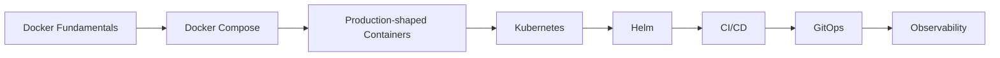

The goal is to understand how container fundamentals become building blocks for larger production platforms.

---

# 52. From Docker to Kubernetes

Docker concepts map naturally into Kubernetes concepts:

| Docker concept | Kubernetes direction |
|---|---|
| Image | Container image |
| Container | Pod container |
| Docker network | Kubernetes networking |
| Container DNS | Kubernetes Service DNS |
| Named volume | PersistentVolume / PersistentVolumeClaim |
| Environment variables | ConfigMap / Secret |
| Healthcheck | Liveness / readiness probes |
| Restart policy | Kubernetes workload controller behavior |
| Compose | Kubernetes manifests / Helm |
| Docker registry | Container registry |
| Docker build | CI image build pipeline |

The next step is to move from manually managed containers toward declarative orchestration.

---

# 53. Lessons From Real Failures

This repository intentionally keeps failures visible.

Examples include:

- YAML indentation problems caused by tabs
- PostgreSQL not being ready immediately after startup
- missing named-volume declarations
- confusing `localhost` with another container
- bind-mount UID mismatches
- unexpected image entrypoints
- incorrect assumptions about exit code `137`
- misunderstanding tags versus digests
- assuming `--no-cache` also refreshes base images
- assuming healthchecks prove complete application health
- mixing Windows Node/npm with Linux WSL tooling
- discovering the difference between container writable storage and persistent volumes

The failures are part of the learning process.

---

# 54. Troubleshooting Principles

When something does not work:

```text
1. Observe
2. Inspect
3. Form a hypothesis
4. Test the hypothesis
5. Change one thing
6. Re-test
7. Document the result
```

Example:

```bash
docker ps -a
docker logs APP
docker inspect APP
docker exec -it APP sh
```

This is much more reliable than making multiple changes simultaneously.

---

# 55. Documentation Philosophy

Documentation in this repository follows a simple rule:

> Record what happened, why it happened, and how it was verified.

A command without understanding is not the end goal.

For important experiments, capture:

```text
Problem
↓
Initial assumption
↓
Command/test
↓
Observed result
↓
Root cause
↓
Fix
↓
Verification
↓
Lesson
```

---

# 56. References

Official Docker documentation:

- Docker documentation
- Docker Engine documentation
- Docker Compose documentation
- Dockerfile reference
- Docker networking documentation
- Docker storage documentation
- Docker image/reference documentation

---

# 57. License

MIT License.

---

# 58. Author

**Nero**

Cloud / Platform / DevOps Engineering

This repository represents my hands-on Docker learning, experiments, troubleshooting, and engineering notes.
